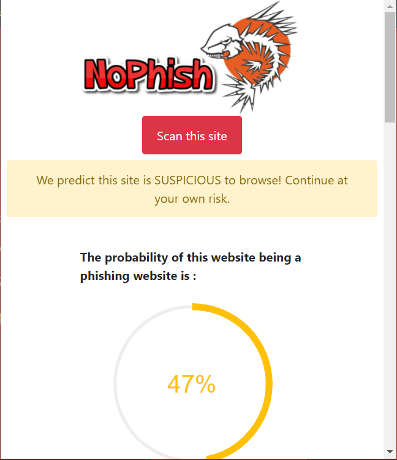

# NoPhish

NoPhish is a Chrome Extension that detects phishing sites and warns the user. The detection is made using machine learning, to be more specific by training a model 
the Random Forest Algorithm.

## Usage 

NoPhish is a Chrome Extension from which the user sends requests to the webserver. 
The webserver takes the URL from the request and first gets the content of the page,
then executes the python script which extracts the features of the website and makes the decision if its a dangerous site or not by using the trained model.

The model was trained using the Random Forest algorithm. 
The dataset can be found at this link : https://archive.ics.uci.edu/ml/datasets/phishing+websites#
Based on the statistics from testing this tool has a predicton accuracy of **96.8%**.

These are some picture of the tool: 

## Developed with

- Python 3.9:  
  -Python libraries:
  - beatifulsoup4
  - google
  - joblib
  - matplotlib
  - numpy
  - python-whois
  - scikit-learn
- Webserver Made with Node.js:
  - Node.js libraries:
  - get-content
  - express
  - body-parser
- Libraries used in front:
  - bootstrap v4.3.1
  - jQuery
  - progressbar.js
  - animate.css

## Developed by

- Leand Thaçi 

